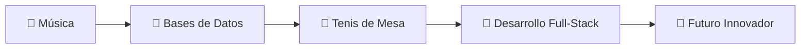

# ¡Hola! 👋 Soy Salvador Reche

<div align="center">
  
</div>

---

## 🎯 Sobre Mí

```python
class SalvadorReche:
    def __init__(self):
        self.nombre = "Salvador Reche"
        self.pasiones = ["Bases de Datos", "Tenis de Mesa", "Música"]
        self.estado = "Construyendo el futuro con datos"
        self.ubicacion = "España 🇪🇸"
    
    def trabajar(self):
        return "Transformando datos en insights valiosos"
    
    def relajarse(self):
        return "Jugando tenis de mesa o escuchando música"
```

## 🛠️ Tecnologías y Herramientas

### 💾 Bases de Datos


### 🔧 Lenguajes de Programación


### 🎾 Pasatiempos Favoritos

<table>
<tr>
<td align="center" width="33%">
  
  <br><b>🏓 Tenis de Mesa</b>
  <br>Rápidos como el ping,<br>precisos como el pong
</td>
<td align="center" width="33%">
  
  <br><b>🎵 Música</b>
  <br>El ritmo que mueve<br>mi código
</td>
<td align="center" width="33%">
  
  <br><b>💾 Bases de Datos</b>
  <br>Donde la información<br>cobra vida
</td>
</tr>
</table>

## 📊 Estadísticas de GitHub

<div align="center">
  
</div>

<div align="center">
  
</div>

## 🎵 Mi Playlist de Desarrollo

```yaml
Desarrollo:
  - 🎵 "Data Flow" - Mi playlist de concentración
  - 🎵 "SQL Symphony" - Para consultas complejas
  - 🎵 "Database Dreams" - Música ambiente para programar

Tenis de Mesa:
  - 🏓 "Ping Pong Power" - Para los entrenamientos
  - 🏓 "Table Tennis Tunes" - Ritmo perfecto para el juego
```

## 🏆 Logros y Certificaciones

- 🥇 **Master de Bases de Datos** - Especialista en optimización
- 🏓 **Campeón Local de Tenis de Mesa** - Velocidad y precisión
- 🎵 **DJ de Datos** - Creando armonía entre información y música

## 🚀 Proyectos Destacados

### 💾 Database Master Suite
```
🔧 Herramientas de gestión de bases de datos
📊 Dashboards interactivos
⚡ Optimización de consultas
```

### 🏓 Ping Pong Tracker
```
📱 App para seguimiento de partidos
📈 Estadísticas de rendimiento
🏆 Sistema de ranking
```

## 📈 Mi Evolución



## 🤝 ¡Conectemos!

<div align="center">

[](https://linkedin.com/in/salvadorreche)
[](mailto:salvador@example.com)
[](https://twitter.com/salvadorreche)

</div>

## 💡 Frase del Día

> *"Los datos son como las notas musicales: cuando se organizan correctamente, crean una sinfonía de información."* 🎵💾

---

<div align="center">
  
  
  **¡Gracias por visitar mi perfil!** ⭐
  
  *"Cada commit es un paso hacia la excelencia"* 🚀
</div>

---

<div align="center">
  
</div>
